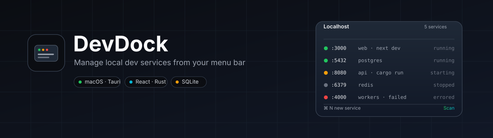
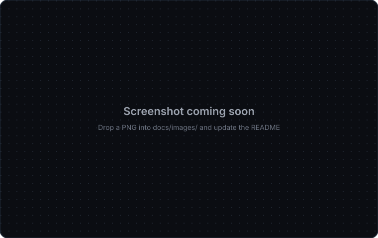

<div align="center">



# DevDock

A macOS menu-bar app that finds what's running on `localhost`, remembers how you started it, and lets you run, stop, and restart your local services without digging through terminal tabs.

[](https://github.com/muhammaddadu/dev-tool-devdock/actions/workflows/ci.yml)
[](./LICENSE)
[](https://tauri.app)
[](https://react.dev)
[](https://www.rust-lang.org)
[](#)

[**↓ Download for macOS, Linux, or Windows**](./docs/downloads.md) · [Latest release](https://github.com/muhammaddadu/dev-tool-devdock/releases/latest) · [Website](https://muhammaddadu.github.io/dev-tool-devdock/)

</div>

---

## Features

- **Localhost discovery** — scans listening ports and surfaces the owning PID, process, command, and `cwd`.
- **Remembered commands** — saves how each service was started so you can run, stop, and restart it tomorrow.
- **Captured logs** — collects stdout/stderr for services DevDock launched.
- **Menu-bar native** — lightweight Tauri app that lives in the macOS menu bar; no Electron, no dock icon.
- **Optional AI assist** — local CLI suggestions for project scans (opt-in).

## Screenshots

<div align="center">



<sub>Replace this placeholder with a real screenshot in <code>docs/images/</code>.</sub>

</div>

## Install

Pre-built binaries for macOS, Linux, and Windows are published on the
[GitHub Releases page](https://github.com/muhammaddadu/dev-tool-devdock/releases) — see
[`docs/downloads.md`](./docs/downloads.md) for direct links and notes on
platform support (macOS is fully supported; Linux is best-effort; Windows
currently ships a stub).

## Quickstart (from source)

```bash
pnpm install
pnpm desktop:dev
```

Requirements:

- macOS 12 or later
- Node 20+
- pnpm 9+
- Rust toolchain (`rustup`, `cargo`)
- Xcode command-line tools

## Project layout

```
.
├── src/              # React frontend (Vite root, contains index.html)
├── src-tauri/        # Tauri / Rust backend
├── docs/             # Product, architecture, engineering, design, decisions
├── public/           # Static assets served as-is
├── scripts/          # Build and icon-generation scripts
└── .github/          # CI workflows
```

## Scripts

| Command              | What it does                                |
| -------------------- | ------------------------------------------- |
| `pnpm desktop:dev`   | Run the full Tauri app in development       |
| `pnpm desktop:build` | Produce a distributable macOS bundle        |
| `pnpm dev`           | Run the Vite frontend only                  |
| `pnpm build`         | Type-check and build the frontend           |
| `pnpm test`          | Run frontend tests (Vitest)                 |
| `pnpm lint`          | ESLint the frontend                         |
| `pnpm typecheck`     | TypeScript noEmit check                     |
| `pnpm rust:test`     | `cargo test` in `src-tauri/`                |
| `pnpm rust:lint`     | `cargo clippy -- -D warnings`               |
| `pnpm rust:fmt`      | `cargo fmt`                                 |

## Documentation

Full docs live in [`docs/`](./docs/README.md):

- [Product requirements](./docs/product/prd.md) · [Roadmap](./docs/product/roadmap.md)
- [Architecture overview](./docs/architecture/overview.md) · [Security](./docs/architecture/security.md)
- [Engineering setup](./docs/engineering/setup.md) · [Testing](./docs/engineering/testing.md)
- [Architecture decisions](./docs/decisions/adr-0001-tauri-rust-react.md)

The contract for AI coding agents working in this repo is in [`AGENTS.md`](./AGENTS.md).

## Contributing

Issues and PRs are welcome. Before opening a PR:

- [ ] Tests added or updated
- [ ] Docs updated
- [ ] UI checked in both dark and light mode
- [ ] Destructive actions are confirmed in the UI
- [ ] No new always-on background work

See [`docs/engineering/coding-standards.md`](./docs/engineering/coding-standards.md) for style and testing conventions.

## License

[MIT](./LICENSE) © Muhammad Dadu
